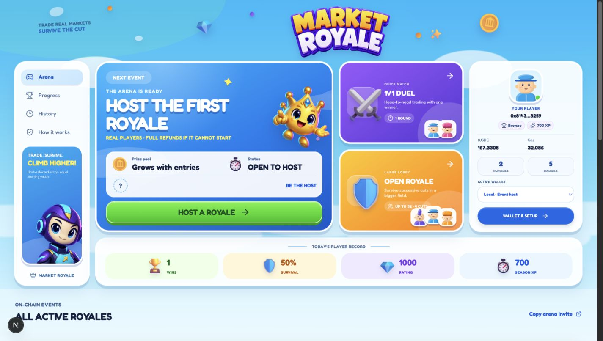
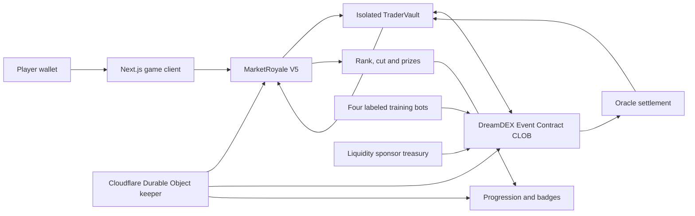

# Market Royale

**Trade real DreamDEX Event Contracts with an equal starting vault, survive each cut, and win the on-chain prize pool.**

Built for the [Somnia × DreamDEX Event Contracts Hackathon](https://dorahacks.io/hackathon/event-contracts/detail). The prototype is live on **Somnia Shannon testnet (chain 50312)** and uses real wallets, real DreamDEX order-book fills, oracle settlement, isolated player vaults, eliminations, payouts, progression, and transparent training bots.



## Why Market Royale

Prediction markets are usually solitary: a trader opens a position, waits for settlement, and leaves. Market Royale turns the same Event Contract liquidity into a competitive multiplayer loop.

Every player receives the same isolated starting bankroll. Players can buy and sell UP or DOWN shares throughout each live market. When the oracle settles a round, the contract values every vault, ranks the field, and eliminates the bottom half. Survivors advance to a fresh market until one winner remains or the configured round limit is reached.

This creates three reasons to play: trading profit, survival progression, and tournament prizes. Hosts can select BTC or ETH, entry contribution, starting vault, capacity, enrollment window, and number of rounds. If an event cannot start or recover safely, contract-defined cancellation paths return eligible funds to their original owners.

## Hackathon fit

| Criterion                           | What Market Royale demonstrates                                                                                                                 |
| ----------------------------------- | ----------------------------------------------------------------------------------------------------------------------------------------------- |
| Innovation · 20%                    | A battle-royale tournament layer over fixed-window UP/DOWN markets, with equal bankrolls and placement-based cuts.                              |
| Technical implementation · 25%      | Real DreamDEX CLOB trades, per-player vault isolation, oracle redemption, multi-round settlement, automated recovery, and on-chain progression. |
| UX and design · 20%                 | A responsive game interface with a no-scroll trading cockpit, live chart actions, leaderboard, P&L previews, and clear transaction states.      |
| Business and ecosystem impact · 20% | A repeatable consumer format that routes new users and recurring trading activity into DreamDEX markets.                                        |
| Presentation and demo · 15%         | A complete testnet flow, public deployment evidence, reproducible local setup, and a prepared 2–3 minute demo script.                           |

## The playable loop

1. **Host or join.** The host automatically becomes player one. Every entrant deposits the same entry contribution and starting vault.
2. **Trade.** Players buy and sell real UP/DOWN shares through their own non-custodial tournament vault. Immediate-or-cancel tickets preview depth, average fill, proceeds, and realized P&L.
3. **Settle.** DreamDEX's oracle payout redeems outcome shares into tUSDC. Cash plus redeemed outcomes determine the vault value.
4. **Survive.** The bottom half is eliminated, rounding survivors upward. Exact ties favor the earlier on-chain entry.
5. **Win.** A duel pays first place. Larger fields pay the top three 80/128, 30/128, and 18/128 of the full entry pool.
6. **Progress.** Completed results update rating, season XP, career statistics, and eight soulbound achievement badges.

The arena takes **no cut from entry contributions**. The funded entry pool is paid as prizes or returned on cancellation. DreamDEX receives the real order flow.

## Architecture



The Cloudflare operator discovers eligible events, checks two-sided depth, backfills local test events, advances settlement, pays recoverable balances, and records progression. It cannot trade from player vaults or redirect player payouts. The browser also keeps permissionless recovery controls available.

## Public Shannon deployment

| Component                 | Address                                                                                                    |
| ------------------------- | ---------------------------------------------------------------------------------------------------------- |
| Market Royale V5          | [`0x4a17…0cd`](https://shannon-explorer.somnia.network/address/0x4a17dc5e798e68060e6e8cadbf795531557880cd) |
| Progression and badges V4 | [`0xaecf…c54`](https://shannon-explorer.somnia.network/address/0xaecf844569aba92494947bc4edf8e268c31b5c54) |
| Liquidity sponsor         | [`0x24a4…701`](https://shannon-explorer.somnia.network/address/0x24a43ad7e9318cf515867477bf9c489989dcc701) |
| DreamDEX binary module    | [`0x3ecC…388`](https://shannon-explorer.somnia.network/address/0x3ecC694Cef705358864a646142ac17A90E29e388) |
| tUSDC collateral          | [`0x70a8…d8E`](https://shannon-explorer.somnia.network/address/0x70a86D8842FB63C4Ad2b7cdddF530eBf1BB25d8E) |

Deployment receipts and transaction hashes are committed in [`deployments/shannon-v5.json`](deployments/shannon-v5.json), [`deployments/shannon-progression-v4.json`](deployments/shannon-progression-v4.json), and [`deployments/shannon-training-bots.json`](deployments/shannon-training-bots.json). Older journals remain as regression and recovery evidence.

## Run locally

Requirements: Node.js 24 and an injected EVM wallet for write actions.

```bash
npm ci
cp .env.example .env.local
npm run dev
```

Open [http://127.0.0.1:3000/#arena](http://127.0.0.1:3000/#arena). Public chain state and live DreamDEX markets load without a private key. To enter or host, connect a Shannon-funded wallet. The application rejects the wrong chain and never falls back to mainnet.

For the full local operator, copy `workers/.dev.vars.example` to `workers/.dev.vars`, supply dedicated Shannon test keys, then run:

```bash
npm run local
```

Secrets belong only in `.env.local`, `.testnet/`, or `workers/.dev.vars`; all three are excluded from Git. Never use a mainnet key.

## Verify

```bash
npm run check
```

The gate runs TypeScript checks, the local EVM contract suite, and a production Next.js build. The suite covers roster and quorum rules, duplicate entry, unauthorized trading, empty and partial fills, donation-resistant scoring, ties, cuts, voids, timeouts, no-trade refunds, permissionless payouts, duplicate recovery, sponsor lifecycle, progression, and a full 64-player settlement and payout.

## Repository guide

| Path                                    | Purpose                                                                              |
| --------------------------------------- | ------------------------------------------------------------------------------------ |
| `app/`                                  | Arena, trading cockpit, player progression, wallet flow, and server routes           |
| `contracts/MarketRoyale.sol`            | Tournament registry, player vaults, settlement, elimination, prizes, and recovery    |
| `contracts/MarketRoyaleProgression.sol` | Rating, seasons, achievements, and sponsor-backed loss protection                    |
| `contracts/LiquiditySponsor.sol`        | Dedicated maker inventory and redemption lifecycle                                   |
| `workers/keeper.ts`                     | Durable event operation, training bots, funding controls, and recovery               |
| `lib/testnet/`                          | Shannon config, DreamDEX reads, wallet integration, and generated contract artifacts |
| `tests/testnet.test.mjs`                | End-to-end local EVM mechanics and edge-case suite                                   |
| `deployments/`                          | Public Shannon deployment and execution journals                                     |

## Submission material

- [DoraHacks submission copy](docs/SUBMISSION.md)
- [2–3 minute demo script](docs/DEMO_SCRIPT.md)
- [Game mechanics audit](docs/game-mechanics-audit.md)
- [Operations and failure safeguards](docs/OPERATIONS.md)
- [DreamDEX SDK and documentation feedback](docs/SDK_FEEDBACK.md)
- [Security policy](SECURITY.md)

## Current scope

Market Royale is a functional, unaudited Shannon testnet product. Four on-chain wallets are visibly labeled as training bots and backfill local test matches so the game loop remains testable; they also place and close real DreamDEX positions. The production design should add stronger human verification and an audited deployment before accepting real-value funds.

## License

Market Royale code and original project assets are source-available under the [PolyForm Noncommercial License 1.0.0](LICENSE). You may inspect, test, modify, and redistribute them only for permitted noncommercial purposes. Commercial use, resale, paid hosting, or incorporation into a commercial product requires a separate written commercial license from the copyright holder.

Third-party components remain under their respective licenses. See [third-party notices](THIRD_PARTY_NOTICES.md) for Microsoft Fluent Emoji and design-export attribution.
